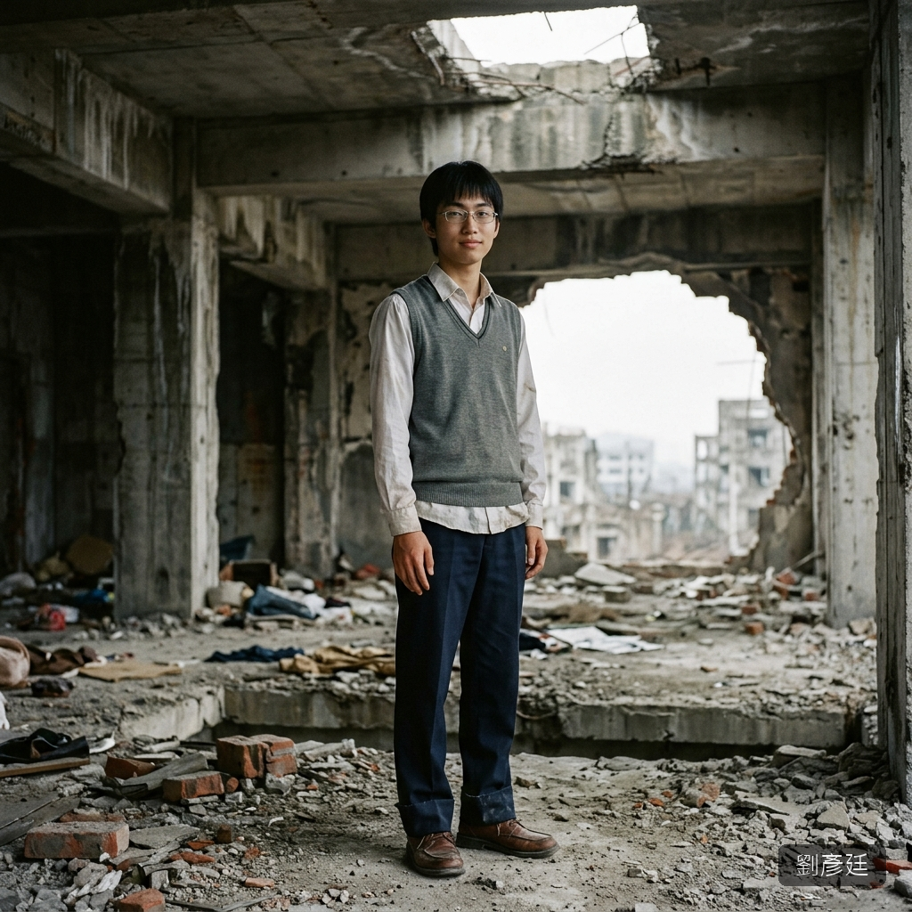

# 👤 劉彥廷（Liu Yen-Ting）

## 核心資料
* **年齡**：17 歲，公立高中高二生（同校，學生會副會長）。
* **長相氣質**：標準的「好學生」長相。乾淨的臉、整齊的瀏海、鼻樑上架著一副銀框眼鏡。五官端正但不突出——那種老師和家長看了就覺得「這孩子很穩重」的臉。笑起來的時候眉眼會微微彎起，給人一種溫和可靠的感覺。但他的笑從來不到眼底——仔細看會發現他的瞳孔在笑的時候是冷的。
* **聲音**：溫和的男中音，字正腔圓。他說話的方式像在做校園演講——條理清晰、語氣柔和、用詞得體。「我只是想保護你」這句話從他嘴裡說出來，簡直像課本上的範例句型。
* **體格**：174 cm / 63 kg。偏瘦的書生體格，不像黃志偉那種壓制型。他的控制不靠力量，靠的是心理操控和語言陷阱。

---

## 背景故事
* **模範生養成**：父親是國中校長，母親是補習班老師。從小在「你要做別人的榜樣」的環境中長大。成績永遠是班上前三，言行舉止永遠得體。但這一切都是「被訓練出來的」——不是他想做好人，而是他學會了「表現得像好人」可以獲得最多的資源和控制權。
* **隱性控制慾**：末日前他就有控制慾的徵兆——他會以「為你好」的名義介入學弟妹的私事，會在學生會中用溫和的語氣否決所有和他意見不同的提案。沒有人覺得他有問題，因為他「態度太好了」。

---

## 個性與心理特質

### 偽善的藝術
他是全書中最會「演」的男性。他的每一句話、每一個表情都經過計算。他不會像黃志偉那樣靠體格直接壓制——他用「邏輯」和「道德綁架」讓獵物自己走進陷阱：
- 「你一個女孩子在外面太危險了，跟著我比較安全」
- 「我不會強迫你，但如果你不信任我，你要怎麼活下去？」
- 「你看，我什麼都沒做對吧？所以放輕鬆」
- 「這是為了我們兩個的生存，你應該理解的」

### 剝落的過程
他的偽裝不是一瞬間崩塌的——是一層一層剝落的：
1. 「保護者」→ 開始限制語晴的行動（「你不要亂跑，很危險」）
2. 「照顧者」→ 開始要求回報（「我保護你這麼久了，你是不是也該……」）
3. 「擁有者」→ 語氣從建議變成命令（「我說了不准就是不准」）
4. 「施暴者」→ 最後的偽裝脫落（「你以為你有選擇嗎？」）

### 「溫柔」的侵犯
他的侵犯方式是全書中最令人作嘔的類型——不是暴力，而是「溫柔」。他會一邊侵犯一邊說「對不起」「我知道你不舒服」「放鬆一點就不會痛了」。他會擦掉語晴臉上的眼淚，然後繼續。這種「帶著溫柔外殼的侵犯」比純粹的暴力更具破壞性——因為它讓受害者無法簡單地將施暴者歸類為「壞人」，會在心理上造成更深的混亂。

---

## ⚠️ 寫作指示
* 他的出場要讓讀者鬆一口氣——「終於遇到一個正常人了」。他的偽善越真實，後面的崩塌才越噁心。
* 偽裝的剝落要慢——不是一章內完成，而是在互動中漸進。讓讀者和語晴一起從「安心」滑向「不安」再滑向「恐懼」。
* 他的死（被蟲族殺死）要帶有諷刺——他死前最後的表情不是恐懼，而是「怎麼可能？我這麼聰明怎麼會死在這裡？」的難以置信。聰明人的傲慢和混種的本能暴力形成對比。
* 他的台詞永遠要「好聽」——即使在做最惡劣的事，他的用詞都是得體的。這種「文明的殘忍」是他的核心恐怖。
