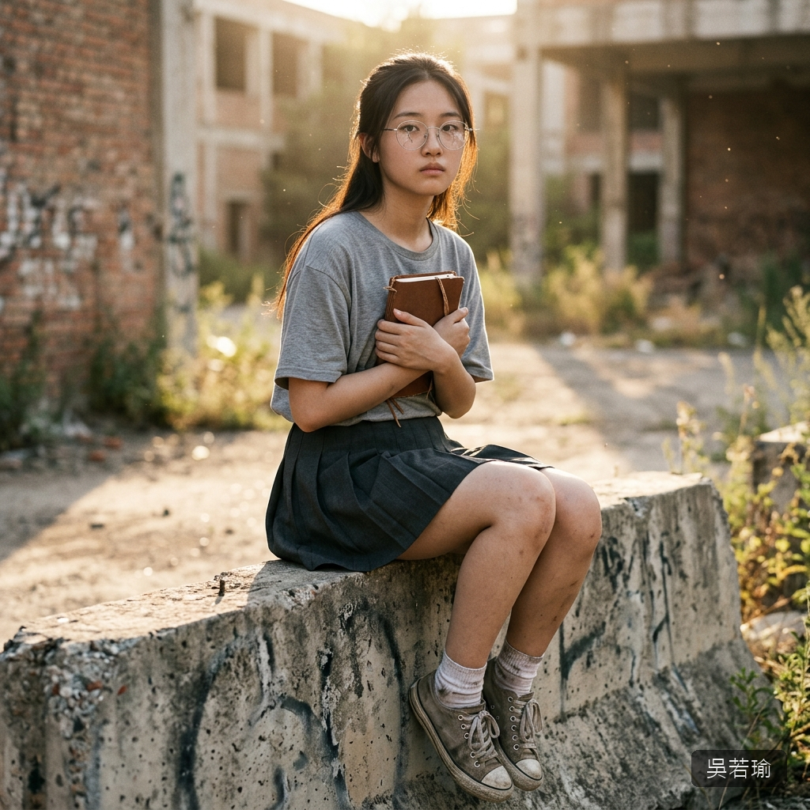

# 👧 吳若瑜（Wu Juo-Yu）

## 核心資料
* **年齡**：16 歲，公立高中高一生（同校，文學社社員）。
* **長相氣質**：安靜的「文青」型。窄長的鵝蛋臉，五官清秀但偏淡——淡眉、淡唇、淡色的皮膚，像是一幅用淺色鉛筆畫出來的素描。戴著一副銀色細框圓眼鏡（末日後碎了一邊的鏡片，但她仍然戴著）。整體氣質是安靜到幾乎透明的——不是存在感低，而是一種「刻意把自己調成靜音」的氣質。
* **髮型**：深黑色的長直髮，平時別在耳後或隨意垂著。沒有任何造型——她對外表的態度是「能看就行」。末日後頭髮變得乾枯打結但她不在意。
* **眼睛**：深灰色的狹長眼——罕見的瞳色，在光線下會呈現出一種帶著銀灰的冷調。眼神極其安靜——不是空洞，而是「在看著什麼你看不到的東西」。她看人的方式像在讀一本書——耐心的、仔細的、帶著某種審慎的溫柔。
* **聲音**：很輕很輕的聲音，像是怕打擾到空氣一樣。語速慢，措辭文雅，偶爾會用一些比同齡人老成的詞彙。她朗讀文章的時候聲音會變得有質感——那是她少數「放開」的時候。
* **性經驗**：零。她對「性」的理解來自文學作品——不是無知，而是一種抽象的、詩意的理解。她讀過谷崎潤一郎和渡邊淳一，但那些文字在她的認知中是「美學」而非「慾望」。

---

## 背景故事
* **書蟲家庭**：父親經營二手書店，母親是圖書館員。她從小在書堆裡長大——三歲學認字、五歲讀完第一本長篇小說。書是她的世界。她的房間三面牆都是書架，床頭永遠疊著五六本正在讀的書。
* **記錄的本能**：她從國小開始寫日記——不是記自己的事，而是記「看到的事」。誰在操場哭了、校門口的流浪貓今天不在了、便利商店的阿姨換了新的髮型。她覺得「被看到」是一種尊重——即使是最微不足道的事，只要有人記住了，它就不會消失。

---

## 肉體特徵與 R-18 美學

### 基礎體態
* **身高/體重**：162 cm / 46 kg。偏瘦的清瘦型——不是病態的瘦，而是「不太記得吃飯」的那種瘦。肩窄、四肢纖長、骨骼輪廓隱約可見。
* **體型**：清瘦纖長型。沒有明顯的曲線——一種「把所有多餘的東西都削去」的簡潔。像是一枝白色的蠟燭——細長、安靜、帶著一種脆弱的優雅。
* **膚色**：極淡的象牙白——因為常年待在室內不曬太陽，膚色白到皮膚下的青色血管隱約可見。質感細膩但缺少血色——有一種病態的、紙一般的蒼白美感。

### 胸部
* **B 罩杯偏小**——存在但不突出。形狀小巧精緻，因為身體脂肪少所以輪廓清晰——能看到肋骨上方微微隆起的弧線。乳暈小而淡，顏色是近乎透明的淺粉——像是紙上暈染的一點水彩。
* 她的胸部在視覺上的特徵是「清瘦的脆弱感」——肋骨的線條和胸部的微弱起伏並存，呈現出一種「紙片人」般的薄透。

### 臀部與腿部
* **臀部**窄小，幾乎沒有肉感。骨盆窄，臀部曲線平坦。
* **腿部**纖長偏瘦——大腿之間有明顯的縫隙（thigh gap），膝蓋顯得有點大因為腿太瘦了。皮膚極白極薄，青色的血管紋路清晰可見。
* 她的腿在被碰觸時最顯著的視覺元素是「白到近乎透明」的膚色——在灰暗的末日背景中，她的腿像兩根發光的白蠟燭。

### 私密部位
* 體毛極稀疏——只有很少的、很細很淡的毛髮，幾乎要湊近了才看得見。
* 外部形態小巧、顏色極淡——接近周圍蒼白膚色的淡粉。整體呈現出和她全身一致的「紙頁般」蒼白透明感。
* 內部狹窄——清瘦的體型讓骨盆腔狹小，加上從未開發，整體非常緊。

### 嗅覺
* **體香**：舊書和墨水的味道——像是剛從圖書館走出來的人，衣服和頭髮上沾著紙張的纖維氣息和一絲淡淡的油墨味。末日後這個味道漸漸被灰塵和廢墟的味道覆蓋，但在她的頸窩深處仍然殘留著。
* **汗味**：因為極少運動且體脂低，汗味極淡——近乎無味。只有在極度恐懼時才會出現一絲冷汗的微酸，薄得像紙上暈開的一滴水。
* **私密部位氣味**：極度微弱——和她整個人的「輕」一致。只有非常近距離才能嗅到一絲帶著體溫的、乾淨的淡味。像是剛翻開一本新書時那股紙張的清香。

### 味覺
* **肌膚**：象牙白的皮膚嚐起來幾乎無味——只有極微弱的淡鹹。質感薄而細膩，像舔一張上好的和紙。血管清晰的部位（手腕內側、頸側）有一絲帶鐵的微苦——那是她貧血體質的味道。
* **汗水**：量極少，味道淡薄如清水。帶著一絲紙張纖維的乾澀感。
* **分泌物**：因為長期營養不良和清瘦體質，分泌量極少——稀薄透明，味道近乎無味，只有極微弱的體溫鹹甜。她的身體像她的文字一樣——極其節制，不多給一滴多餘的東西。

### 特殊體質與感官反應
* **安靜的疼痛**：她對疼痛的反應是極度內斂的——不會叫喊、不會求饒。她的痛感反應全部壓縮在微表情裡——眉頭極輕地蹙起、嘴唇微微發白、手指不受控制地抽搐。如果不仔細觀察，甚至看不出她在痛。
* **解離傾向**：在極端恐懼和疼痛中，她的意識會進入一種「旁觀者」模式——像是靈魂飄到了身體上方，冷靜地觀察著正在發生的一切。她不是在忍耐，而是她的大腦自動啟動了保護機制，讓她和痛苦隔了一層玻璃。
* **記錄的本能（即使在被侵犯時）**：這是她最獨特也最令人心碎的特質。即使在最惡劣的處境中，她的大腦仍然在「記錄」——施暴者的臉、傷口的形狀、牆壁上裂縫的走向。她不是在忍耐，她是在「當一個觀察者」——因為如果她停止記錄，她就什麼都不是了。
* **聲音特徵**：R-18 場景幾乎是無聲的——偶爾有極輕的、像是吞嚥口水時的咕嚕聲、或是鼻腔裡極輕的氣音。她的沉默不是「拒絕給反應」的反抗，而是「我已經不在這個身體裡了」的解離。

### 反抗方式
幾乎沒有肢體反抗。她的身體在被碰觸時會微微僵硬，但不會掙扎。不是因為放棄了，而是因為她的意識已經「抽離」了身體——反抗的指令無法從大腦傳達到四肢。她唯一的「反抗」是不肯閉上眼睛——她用那雙灰色的眼睛安靜地看著施暴者，看著一切，記住一切。這種「被注視」的感覺有時候會讓施暴者不舒服——她的眼神太安靜了，安靜到像在審判。

---

## 個性與心理特質

### 安靜的觀察者
她的核心身份是「記錄者」。不是參與者、不是反抗者、不是受害者——是觀察者。她用文字和記憶保存這個世界正在消失的東西。筆記本是她的靈魂——只要筆記本還在，她就還在。

### 超齡的成熟
她的心理年齡比同齡人大很多——大量的閱讀讓她過早地理解了世界的殘酷。她對末日的反應不是恐懼或崩潰，而是一種「果然如此」的平靜——好像她在書裡早就讀過這個故事了。

### 「至少要有人記住」
她在筆記本上記下每一個她遇到的人的名字——活著的、死去的、認識的、不認識的。她覺得只要她記住了，那些人就不會完全消失。筆記本最後一頁寫著的那個名字和歪歪扭扭的笑臉，是她留給這個世界最後的禮物——「我記住你了。」

---

## ⚠️ 寫作指示
* 她的台詞要有文學感——用詞比同齡人精準、老成，偶爾會引用她讀過的東西。
* 她的眼鏡（碎了一片）是重要的視覺符號——不要讓她摘下來。碎掉的鏡片代表她仍然在「看」，只是世界在她眼中已經碎裂了。
* R-18 場景中她的「解離」是核心機制——她不在那個身體裡，她在記錄。寫她的時候要用一種「攝影機」般的冷靜視角——因為那就是她看待自己的方式。
* 筆記本和笑臉是全書的情感高潮之一——要讓讀者在讀到的時候覺得心臟被捏住了。
