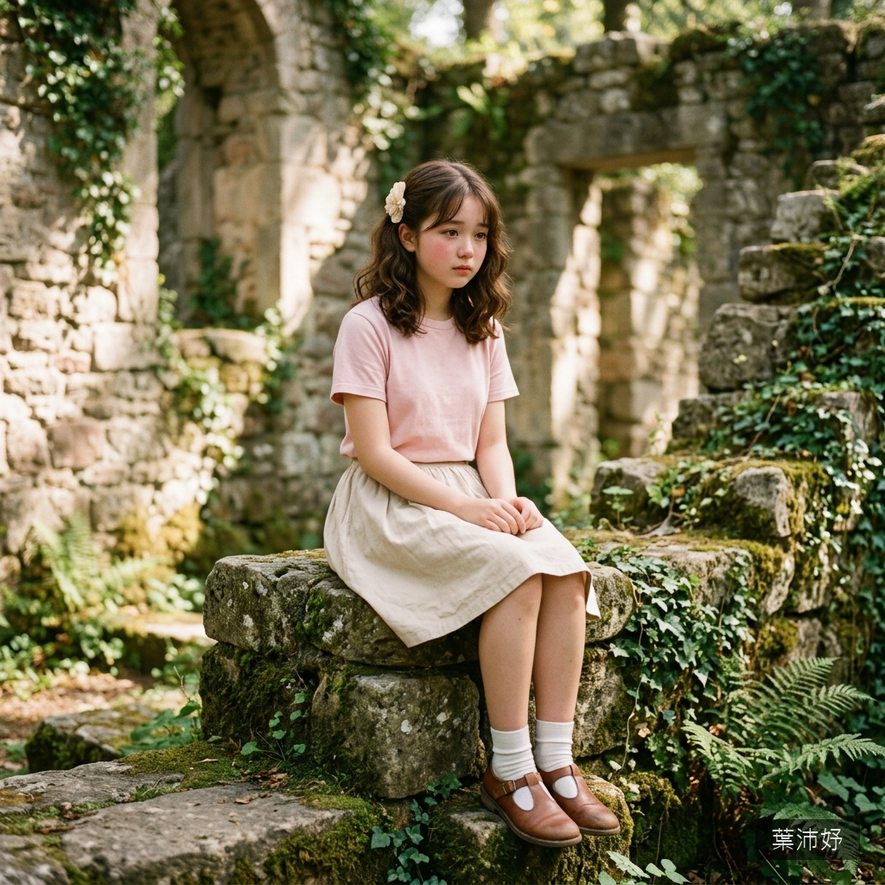

# 👧 葉沛妤（Yeh Pei-Yu）

## 核心資料
* **年齡**：15 歲，公立高中國中部九年級。
* **長相氣質**：嬰兒臉的「妹妹型」。臉頰圓圓的還帶著嬰兒肥，五官小巧集中，大大的水汪汪眼睛佔了臉的三分之一。看起來像小學高年級——如果不說年齡，沒人猜得到她已經 15 歲了。整體氣質是「需要被保護的小動物」。
* **髮型**：及肩的微捲棕髮，經常用兩個幼稚的髮夾別在耳後。末日後髮夾只剩一個，歪歪地掛在左邊。
* **眼睛**：又大又水的深棕色瞳孔，睫毛又長又密。眼眶淺，一害怕就泛紅，淚腺極其發達——幾乎是「隨時都在哭」的狀態。不哭的時候，眼神帶著一種小鹿般的怯生生。
* **聲音**：細細軟軟的少女嗓音，尾音會自然上揚帶著撒嬌的語氣。害怕的時候聲音會變成顫抖的氣音，哭的時候是那種讓人心碎的抽噎——吸氣的聲音比哭聲更大。
* **性經驗**：完全為零。連健康教育課本都是紅著臉翻過去的。看到電視上接吻的畫面會用手捂住眼睛。對「性」的理解幾乎為零。

---

## 背景故事
* **獨生女**：家境中上，父母都是上班族。從小被當作寶貝養大，沒有吃過苦、沒有受過欺負、沒有獨自面對過任何困難。她的「脆弱」不是裝出來的——而是真的從來沒有被要求堅強過。
* **膽小的程度**：怕黑、怕蟲、怕打雷、怕陌生人。連學校的校慶鬼屋都會嚇哭。她是那種需要有人牽著手才能過馬路的孩子——15 歲了，心理年齡還停留在 10 歲。

---

## 肉體特徵與 R-18 美學

### 基礎體態
* **身高/體重**：148 cm / 38 kg。極度嬌小——在同齡人中也是最矮的那一群。整個人像一隻小貓，可以被成年男性單手舉起來。
* **體型**：完全未發育完成的少女體態。骨架極小，手腕細到拇指和中指可以圈住。肩寬窄、腰細、臀部平坦。從任何角度看都像是一個孩子。
* **膚色**：偏白的奶油色，帶著少女特有的淡粉色調——臉頰、耳尖、手肘內側、膝蓋內側都會自然泛粉。

### 胸部
* **AA 罩杯**——幾乎完全平坦，只有極輕微的隆起。乳暈極小，顏色是透明感的嫩粉色，幾乎和周圍皮膚融為一體。像是尚在發育初期的蓓蕾。
* 平坦的胸口讓她的鎖骨和肋骨隱約可見，整個上身呈現出一種未完成的、脆弱到極致的少女感。

### 臀部與腿部
* **臀部**小而平坦，幾乎沒有曲線。和她的整體體態一樣帶著「未發育」的特徵。
* **腿部**極其纖細——大腿的粗度可能只有成年女性的一半。皮膚上沒有任何瑕疵，像是從來沒有被陽光照射過的室內植物。膝蓋圓圓的，小腿線條柔軟。
* 她的腿太細了——被強行分開的時候，施暴者甚至不需要用力，就像是掰開一根柳枝。

### 私密部位
* 完全無毛——不是天生體質，而是發育尚未完成。私密區域呈現出極度幼態的外觀——顏色是透明感的粉白色，形態極度緊閉小巧，像是一條淺淺的線。
* 內部極度狹窄——不是緊窄，而是物理上「太小」。甚至連一根成年男性的手指進入都會造成明顯的疼痛。強行進入的結果必然是嚴重的物理性損傷。

### 嗅覺
* **體香**：嬰兒般的奶香——那種新生兒身上特有的、溫暖的、帶著牛奶和棉花糖氣息的甜味。即使在末日的髒汙中，她的頭髮和頸窩仍然殘留著這股氣味，像是一個被遺忘在廢墟中的嬰兒毯。
* **汗味**：因為緊張和恐懼導致的冷汗幾乎沒有味道——淡到像蒸餾水。只有在極度驚恐大量出汗後，才會散發出一絲微酸的、像是嚇壞了的小動物的氣味。
* **私密部位氣味**：因為完全未發育，幾乎沒有氣味——只有極微弱的、帶著體溫的嬰兒粉般的淡甜。乾淨到不像是一個活人的程度。

### 味覺
* **肌膚**：奶油色的皮膚嚐起來極淡極甜——像是淡牛奶化在舌尖的感覺。臉頰和耳後最甜，帶著一絲嬰兒肥特有的綿密口感。
* **汗水**：冷汗的味道像是稀釋過的鹽水——淡到幾乎嚐不出來，帶著一絲微酸。
* **淚水**：她最大量的體液。溫熱的、鹹的、帶著少女特有的微甜餘味。因為哭泣時間極長，臉頰上的淚痕風乾後會留下淡淡的鹽漬感。
* **分泌物**：因為未發育，幾乎沒有分泌——在物理損傷後流出的液體混合著血的鐵鏽味，是她的R-18場景中最殘酷的味覺元素。

### 特殊體質與感官反應
* **極低的痛覺閾值**：對疼痛極度敏感——輕微的碰觸就能引發劇烈的痛感反應。被掐一下就會尖叫，被打一下就會蜷縮成一團。
* **淚腺失控**：恐懼、疼痛、驚嚇都會觸發無法控制的哭泣。她的哭是最「原始」的——不是壓抑的嗚咽或無聲的流淚，而是像嬰兒一樣的嚎啕大哭，聲嘶力竭，帶著斷斷續續的求饒。
* **應激性蜷縮**：面對恐懼時的本能反應是把自己縮成最小——膝蓋縮到胸口、雙手抱頭、臉埋進膝蓋。像是一隻把自己縮進殼裡的蝸牛。
* **聲音特徵**：她的 R-18 場景中最主要的聽覺元素是「哭喊」——不是罵人也不是沉默，而是最原始的、讓人聽了胃裡翻攪的少女哭喊。會喊名字、會喊「不要」「痛」「救我」，聲音越來越嘶啞但停不下來，直到嗓子徹底啞掉。

### 反抗方式
她幾乎沒有反抗能力——不會咬、不會踢、不會罵。她的「反抗」只是縮成一團、拼命推、搖頭、哭。這種毫無威脅性的抵抗反而會激發施暴者的施虐慾——像是在逗弄一隻怎麼都跑不掉的小動物。

---

## 個性與心理特質

### 極度依賴型
她需要有人在身邊才能呼吸。獨自一人的時候恐懼會直接讓她癱瘓——不是比喻，是真的雙腿發軟站不起來。她會本能地抓住身邊任何讓她感覺安全的人，像溺水的人抓住浮木。

### 純粹的天真
她的天真不是「選擇相信世界的好」，而是「根本不知道世界的壞」。她活在一個被父母保護得密不透風的泡泡裡——這個泡泡一旦被戳破，她沒有任何心理資源去應對。

### 容易讓人產生保護慾
她的存在本身就是一種「觸發器」——任何有一絲善良的人看到她都會想保護她。但在末日中，這種「讓人想保護」的特質也會成為詛咒——因為有些人想「保護」她的方式和善意完全無關。

---

## ⚠️ 寫作指示
* 她的台詞幾乎都帶著哭腔——即使在不哭的時候，語尾也是顫抖的。
* 她抓住別人手臂或衣服不放的動作是她的核心視覺符號。
* R-18 場景中，她的「小」是核心視覺衝擊——成年男性和她的體型差距會讓場景自帶極端的壓迫感。
* 她的哭聲是場景中最殘酷的聽覺元素——讓讀者想堵住耳朵但堵不住。
