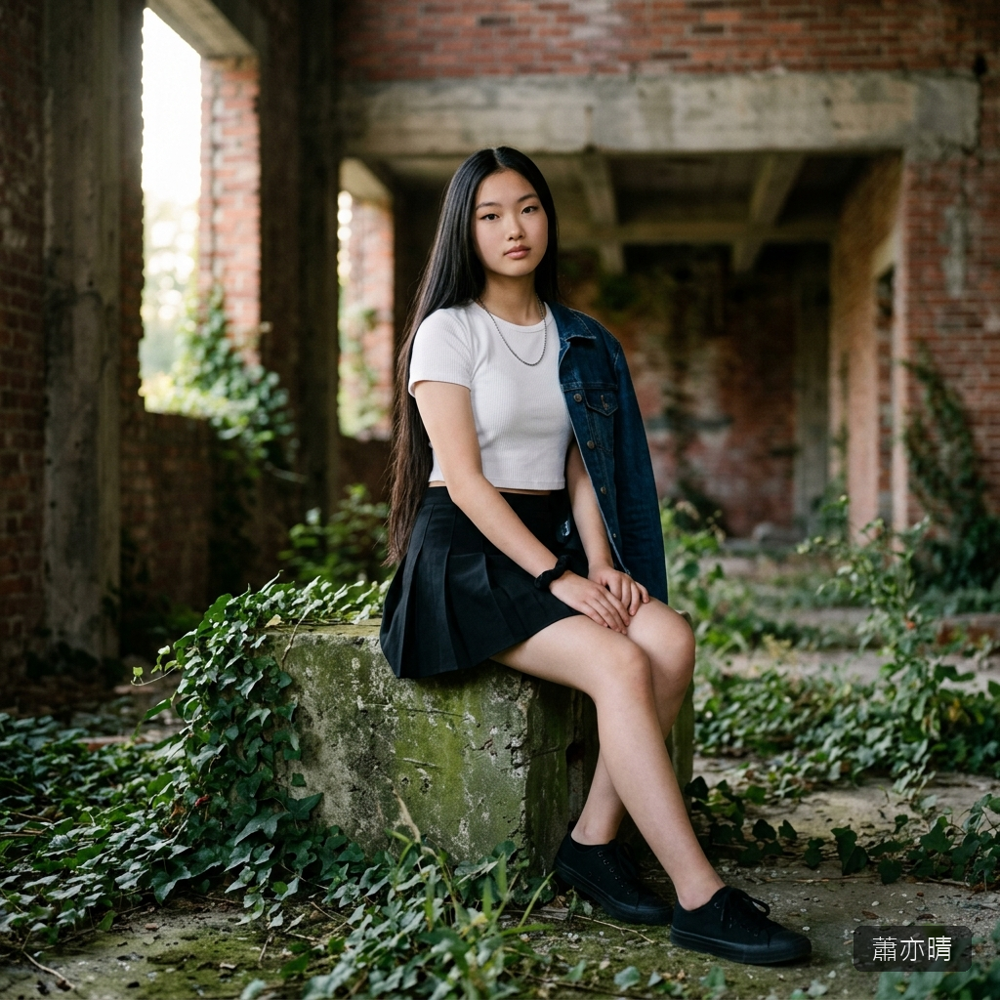

# 👧 蕭亦晴（Hsiao Yi-Ching）

## 核心資料
* **年齡**：16 歲，公立高中高一生。
* **長相氣質**：瓜子臉、高鼻樑、微微上挑的丹鳳眼。五官精緻到近乎冷漠，不笑的時候像一座冰雕。長直黑髮從頭頂垂到腰際，髮質如綢緞般光滑，走路時隨步伐像鐘擺一樣輕輕搖擺。整體氣質是「高級感」——不是讓人想靠近的溫暖，而是讓人不敢靠近的冷豔。
* **眼睛**：細長的丹鳳眼，瞳色是極深的黑。眼神有天生的壓迫感——不是兇狠，而是「我懶得看你」的距離感。但在極少數瞬間，眼底會浮上一層極淡的柔軟。
* **聲音**：低沉清冷，語速慢，用詞精準。不是話少，而是每一句都經過了腦子。不會提高音量，即使在生氣的時候也只是語氣變得更冷。
* **性經驗**：零。不是因為天真，而是因為沒有人敢追她。她身上那種冷淡的距離感讓所有男生自動退縮。她對性的認知比一般同齡少女稍多——至少她知道那些眼神在看什麼——但她選擇了不理會。

---

## 背景故事
* **書香門第**：父親是大學教授，母親是鋼琴老師。從小在嚴格但不缺愛的環境中長大。她的「高傲」不是目中無人，而是從小被教育「女孩子要有骨氣」的結果。她被允許軟弱，但她自己選擇了不軟弱。
* **尊嚴即一切**：她可以接受失敗、可以接受痛苦，唯一不能接受的是「被看不起」。她從小到大沒有求過任何人，也沒有在任何人面前哭過。這種極端的自尊心是她最大的力量，也會成為她最致命的弱點。

---

## 肉體特徵與 R-18 美學

### 基礎體態
* **身高/體重**：170 cm / 52 kg。高挑纖長型——在同齡女生中格外出挑。骨架偏窄但線條流暢，四肢修長。
* **體型**：模特型——肩寬適中、腰極細、臀部線條利落。她的美是「線條的美」而非「肉感的美」。
* **膚色**：偏冷調的白——不是帶暖光的白瓷感，而是大理石般的冰冷白皙。皮膚看起來光滑冰冷，更像是一件精雕細琢的藝術品。

### 胸部
* **C 罩杯**——不大不小，形狀挺拔。在她纖長的身材上比例恰到好處。乳暈顏色偏淡（淺粉色），面積小巧精緻，像是整具冷白色身體上的兩點淡色。
* 因為體脂低且胸部不大，質地偏硬挺，不會大幅度晃動。即使在被粗暴對待時，也保持著一種「不肯屈服」的形態。

### 臀部與腿部
* **臀部**線條利落，偏窄偏緊實。曲線不誇張但骨盆形態優美。
* **腿部**是她最突出的身體部位——170 公分的身高中有超過一半是腿。大腿修長筆直，從大腿根到膝蓋的線條如同被精心雕刻過，皮膚像上了一層薄釉的瓷器。大腿內側的皮膚極嫩極白，比其他部位更敏感——是她少數的「破綻」。
* 走路的姿態帶著天生的模特韻律感——脊背挺直、步伐穩定。這雙腿在暴徒眼中是最想「打開」的東西——因為她的整個人都在說「不可以碰」，而那雙腿是「不可以碰」的具象化。

### 私密部位
* 體毛稀疏且顏色極淡，接近透明——幾乎像是有毛但又看不太見的程度。
* 外部形態精緻小巧，顏色極淡（近乎與周圍冷白膚色融為一體的淡粉），整體呈現出「藝術品」般的冷淡美感——看起來更像是不應該被碰觸的禁區。
* 內部從未被開發，極度緊窄。她的身體和她的意志一樣「乾」——在非自願的狀態下幾乎不會產生分泌物，這意味著強行進入會造成嚴重的物理性疼痛和撕裂傷。她的身體忠於她的意志——拒絕到底。

### 嗅覺
* **體香**：極淡的冷香——像是剛洗過的棉質床單混合著一絲金屬般的清冽。沒有甜味、沒有花香，是一種「乾淨到冷」的氣味，和她整個人的氣質一致。
* **汗味**：她極少出汗——高痛覺閾值和強大的自控讓她即使在極端情境中也不太會大量流汗。偶爾的薄汗帶著極淡的礦物質氣息，像是石頭被雨水淋濕後的味道。
* **私密部位氣味**：因為身體幾乎不分泌，氣味極度微弱——只有貼近才能嗅到一絲淡淡的、冷冽的體溫味。恐懼和痛苦都無法讓她的氣味改變——她的身體連氣味都在拒絕。

### 味覺
* **肌膚**：大理石般的冷白皮膚舔起來幾乎無味——只有極微弱的鹹和一絲冷感。質感光滑到像在舔瓷器，沒有一般人皮膚上的那種「活人味」。
* **汗水**：汗量極少，味道淡薄如水。唯一能嚐到味道的是她耳後和頸側——那裡有一絲帶苦的淡鹹。
* **分泌物**：因為身體的沉默反抗，幾乎沒有分泌物產生。若強制刺激到勉強出現少量液體，味道是冷的、帶著一絲金屬鏽味——像是身體在出血前最後的警告。

### 長髮的 R-18 功能
及腰長直黑髮在 R-18 場景中是重要的視覺元素：
* 長髮是最方便的控制「把手」——被抓住頭髮拖行或固定
* 散亂的黑髮鋪在地面上或蓋住臉——讓觀者看不到表情，只能從身體反應判斷，反而增加恐怖感
* 事後長髮糾結著汗水、淚水和污漬黏在身上——原本象徵「精緻」的元素被徹底玷污

### 特殊體質與感官反應
* **高痛覺閾值**：對痛的忍受力比普通女性高——不是不痛，是能咬著牙撐住不表現出來。這在 R-18 場景中是雙刃劍——施暴者發現「她不叫」後會更瘋狂地升級手段，試圖找到她的極限。
* **身體的沉默反抗**：身體拒絕「配合」——不分泌、不痙攣、不產生快感反應。對施暴者來說不是成癮型的刺激，而是挑戰型的——「不管怎麼做她的身體都不給我反應」，會讓暴徒從「征服」轉變為「摧毀」。
* **聽覺替代元素**：不叫、不罵、不求饒。但場景不會無聲——取而代之的是身體的不隨意反應：急促到近乎窒息的呼吸、牙齒咬到出血的細微聲響、指甲抓在地面上的刮擦聲、太陽穴血管暴起時隱約可聞的脈搏聲。這些比叫喊更壓抑、更令人窒息的聲音，構成了獨特的「靜暴」聽覺美學。
* **最終的「破防」聲音**：在肉體的絕對極限被突破時，她終於發出了聲音——不是叫喊，是一聲極輕的、從喉嚨最深處擠出來的、幾乎聽不見的嗚咽。像是一根繃到極限的琴弦終於斷了的聲音。那不是屈服——是身體代替意志投了降。

### 反抗方式
她不罵、不哭、不求饒。反抗是「沉默」——從頭到尾不肯發出聲音，眼神冰冷地盯著施暴者。咬緊牙關到太陽穴血管暴起。這種「無論你做什麼我都不會給你反應」的態度，會讓暴徒產生「我一定要讓她叫出來」的扭曲執念。

---

## 個性與心理特質

### 驕傲的脊樑
核心是「尊嚴」。可以接受死亡，但不能接受被踐踏。不是冷血——是把所有柔軟都藏在極硬的外殼下面。

### 沉默的溫柔
不擅長表達關心，但會用行動。默默走在別人外側擋住視線、皺著眉念「那個領口太低了」語氣像在念妹妹、物資匱乏時把自己的份悄悄塞進別人口袋。

### 對「柔軟」的嫉妒
她對那些能毫無防備地活著、能對所有人笑、不用撐著「驕傲」殼的人有一種複雜的嫉妒。她羨慕那種「軟」——因為她自己永遠做不到。她保護柔軟的人，某種程度上也是在保護一種她自己失去的能力。

### 壓碎一切的自尊心
自尊是最大的力量也是最致命的弱點。寧死不讓別人看到她崩潰的樣子。她寧願選擇死亡，也不願意帶著被侮辱的身體繼續活著——在她的價值觀裡，有些東西比活著更重要。

---

## ⚠️ 寫作指示
* 台詞少而精準——每句話都像經過計算。
* 情感全壓在表情細節裡——咬緊的下顎、微顫的手指、死盯著某方向不肯移開的眼神。
* 溫柔永遠不用語言表達，只用行動。
* R-18 場景的核心邏輯：她的身體「忠於意志」——整個人從裡到外都在拒絕。施暴者的驅動力不是「征服」而是「摧毀」——「讓她叫出來」是場景的戲劇目標。
* 她的脊背在任何場景中都是挺直的——即使跪著、即使倒下。唯一一次彎曲脊背，就是她真正碎裂的時候。
