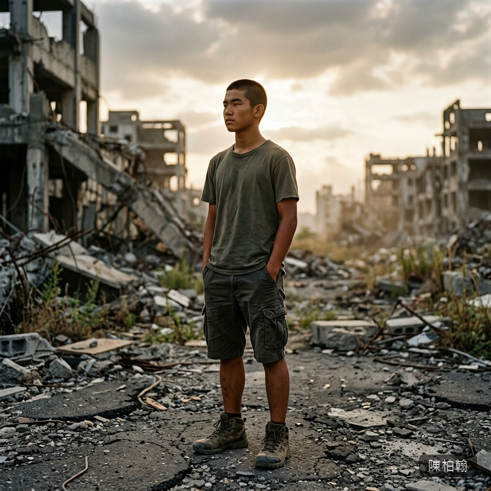

# 👦 陳柏翰（Chen Po-Han）

## 核心資料
* **年齡**：17 歲，公立高中高一生（因國小曾休學一年而比同學大一歲）。
* **身份**：班上存在感不高的安靜男生。籃球社替補，成績中等偏上。
* **長相氣質**：輪廓分明但不算帥的那種臉——眉毛粗而直，眼睛不大但沉穩。短寸頭，皮膚偏黑（常在戶外活動曬的）。不是帥得引人注目的類型，而是越看越耐看的長相。笑的時候會露出一顆虎牙。
* **眼睛**：深棕色的眼睛，眼神安靜。他看人的方式和一般男性不同——沒有慾望、沒有計算，只有一種乾淨到近乎透明的注視。
* **聲音**：低沉偏啞，話極少，語速慢。說話的時候常常看著地面或旁邊，不太敢直視別人。

---

## 背景故事
* **外公的山**：外公住在苗栗的山上，經營一小塊果園。柏翰從小每年暑假都被送去住兩個月——在山上跑、抓蟲、在溪裡摸魚、跟外公學設陷阱捕野兔。他的野外生存能力全來自這裡——不是學校教的，是外公手把手帶出來的。
* **沉默的原因**：外公在他國一那年過世了，他休學了一年。他不是天生寡言，而是在外公過世後變得不太會和人說話了。他把所有想說的話都吞進去，變成了一個又一個沉默的小動作。

---

## 體格與生存能力
* **身高/體重**：175 cm / 65 kg。中等偏瘦但結實——不是壯碩型，是精幹型。長期的戶外活動讓肌肉是功能性的而非觀賞性的。
* **手**：粗糙的手——指節上有老繭，指甲剪得很短。他碰觸別人的時候手是輕的，像是怕弄碎什麼。
* **生存技能**：會設簡易陷阱捕小動物、辨識安全水源、用樹枝搭建簡易遮蔽、用石頭和繩子做粗糙的武器。這些技能在末日中成為了極其珍貴的生存資本。

---

## 個性與心理特質

### 沉默的守望
柏翰是那種「站在角落看你」的人。不起眼——不是焦點、不是成績最好的、不是最帥的。但他會在別人被盯上的時候默默走過去擋在旁邊。他從來不說為什麼。

### 笨拙的溫柔
不會說漂亮的話。想表達關心只會做動作——把水遞過去、把路上碎玻璃踢開、在別人旁邊多走半步擋住風。溫柔全藏在不引人注目的小動作裡。

### 務實的生存者
面對突發狀況不恐慌、不崩潰——不是勇敢，是天生「先做再說」的人。外公教給他的東西在需要的時候會自然浮現。

### 不問過去
看到別人身上的傷痕和眼神裡的東西，他什麼都不會問。只會安靜地遞過去水壺或食物。他的善良是一種「不打擾」的善良。

---

## R-18 場景定位

柏翰的 R-18 場景定位是「正常性愛」的承載者。他的場景基調完全不同於暴力性的 R-18：

| 暴力型 R-18 場景 | 柏翰的場景 |
|---|---|
| 恐懼、暴力、痙攣、背叛 | 顫抖、笨拙、試探、心疼 |
| 施暴者主導 | 女方主動靠近 |
| 身體的背叛 | 身體的試探性接受 |
| 哭泣 = 痛苦 | 哭泣 = 找回遺忘的溫柔 |

**場景關鍵細節**：
* 他的手在發抖——因為緊張和珍惜，不是因為慾望。
* 每一次感覺到對方身體僵硬都停下來，不說話，安靜地等。等呼吸平穩了，才繼續。
* 他唯一近似告白的話不會直接說「我喜歡妳」——而是類似「妳笑起來的時候，世界看起來沒那麼糟」這樣迂迴的話。

---

## ⚠️ 寫作指示
* 全書台詞不超過十句。所有情感都通過動作傳達。
* 看別人的眼神要寫得極度乾淨——和故事中所有其他男性的眼神形成核心對比。
* R-18 場景的基調和全書其他場景完全相反。重點不是身體描寫，而是兩個人之間的「小心翼翼」。
* 他的死亡要越平靜越好。不要壯烈。就是一個安靜的男孩安靜地死了。
