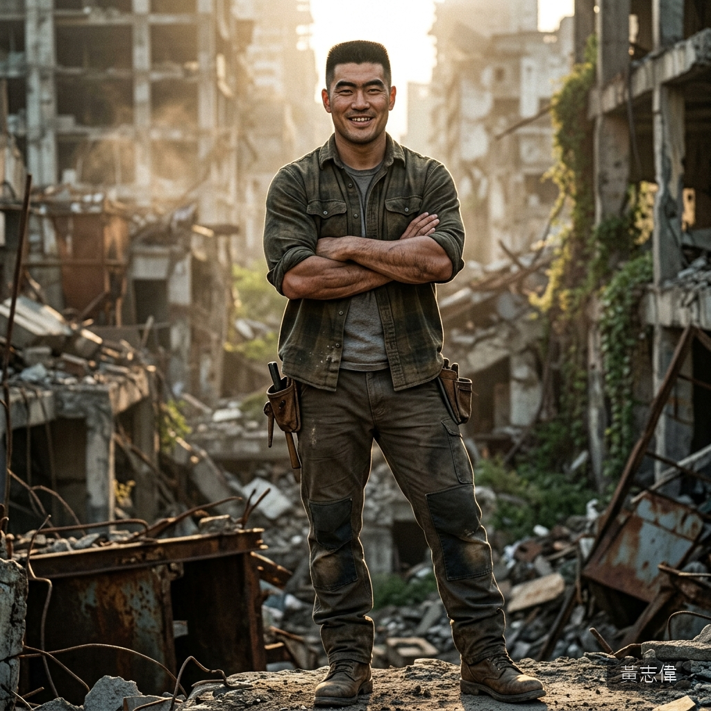

# 👤 黃志偉（Huang Chih-Wei）

## 核心資料
* **年齡**：32 歲，末日前為建設公司工地主任。
* **長相氣質**：中等偏上的外表——不帥但「看起來很可靠」。方臉、濃眉、短平頭。身材壯碩但不誇張，像是長年做體力活練出來的實用型肌肉。笑起來的時候嘴角會微微歪，露出一顆虎牙——這讓他看起來有一種「大哥哥」的親切感。但仔細看他的眼睛就會發現不對——眼神在掃視的時候會在特定部位停留太久，然後迅速移開，像是一種練習過的偽裝。
* **聲音**：低沉渾厚的男中音，語速穩定，帶著一種刻意營造的「沉穩感」。他擅長用語調製造信任——「別怕，跟著我走就對了」這種話從他嘴裡說出來，會讓人不自覺地點頭。
* **體格**：178 cm / 82 kg。肩寬體壯，手掌粗大有繭。前臂肌肉結實，單手就能輕鬆箝制住一個少女的雙手。

---

## 背景故事
* **工地出身**：高職畢業後直接進工地，十年間從小工做到主任。他的社交能力是在工地的男性社會中磨出來的——懂得看人臉色、懂得什麼時候該示好、什麼時候該施壓。
* **末日前的暗面**：末日前他就有過數次騷擾女性下屬的「前科」，但都被工地文化的「開開玩笑而已」輕鬆帶過。他不覺得自己有問題——在他的世界觀裡，女人是可以用「保護」和「提供資源」來換取的東西。末日只是撕掉了他最後一層社會化的面具。

---

## 個性與心理特質

### 獵人思維
他不是衝動型的暴徒——他有耐心。他會先觀察獵物的狀態：疲憊程度、警戒心高低、身邊有沒有同伴。確認安全後才動手。這種「先取信再下手」的模式是他末日前在社會中學會的——只是末日後不再需要收尾。

### 自我合理化
他不認為自己是壞人。在他的腦子裡，他的行為有一套完整的邏輯：「我給了她食物和保護，她應該回報我」「這個世界已經沒有法律了，弱肉強食是自然法則」「她這種長相在外面早晚會被人盯上，跟著我至少我不會打她」。這種自我催眠讓他在施暴時不會有任何猶豫。

### 大意與傲慢
他的致命弱點是**過度自信**。他相信自己的體格和經驗足以應付一切——這讓他在「得手之後」會徹底放鬆警惕，不設防備。正是這份大意讓混種有機會突襲。

---

## ⚠️ 寫作指示
* 他的台詞要「可信」——讀者在第一時間應該和語晴一樣覺得「這個人好像可以信任」。偽裝的崩落要有過渡：「我帶你去安全的地方」→「先休息一下」→「別怕，我不會傷害你」→ 動手。
* 他的暴力不是狂暴型——而是「理所當然」型。他不會打人，不會罵人。他只是把語晴的反抗當作「不懂事」，用體格差距輕鬆壓制，嘴裡還在說「乖，不痛」。這種「溫和的暴力」比純粹的暴力更令人毛骨悚然。
* 他的死要突然——正當他最放鬆的時候，混種從陰影中撲出。他甚至來不及反應就被撕開。暴力的瞬間終結暴力。
