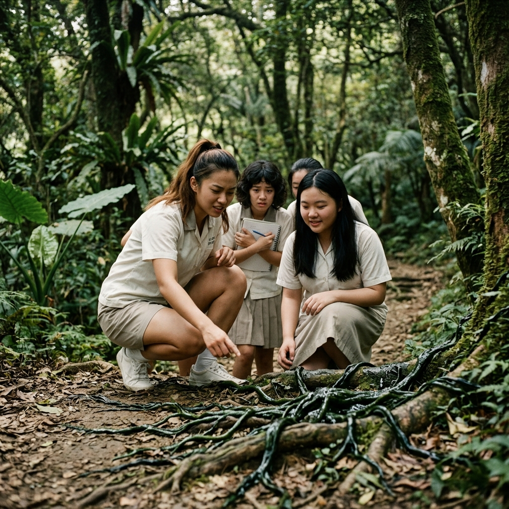

# 第一章　最後的日常

巴士很吵。

語晴覺得這台遊覽車大概是全世界最吵的地方。比餐館週五晚上滿座還吵，比芷涵一個人的音量還吵——雖然芷涵一個人的音量已經很吵了。

七月。暑假第一週。學校不知道為什麼安排了一天的戶外教學——北郊山腳下什麼自然生態園區。語晴覺得「暑假還要去學校活動」這件事本身就很奇怪，但老師說是生物科的加分機會，芷涵說不去的人是白痴，所以她就來了。

車窗外的陽光白花花的，曬得金屬窗框燙手。車裡的冷氣跟沒開一樣——不對，比沒開還慘，因為三十幾個人擠在一起，體溫直接把空調打敗了。語晴覺得自己的後背已經濕了，小可愛黏在皮膚上，那種貼著的觸感讓她一直想把布料往外拉。

她已經把制服外套脫了。白色的小可愛很薄，領口有點寬，但至少透氣。

「妳可不可以注意一下。」

芷涵伸手把脫下的外套拎起來，不由分說地搭回語晴肩上。語氣像在罵人，但動作很輕。

「好熱嘛——」語晴扭著肩膀想把外套甩掉。七月欸，穿外套是要逼死誰。

「熱也穿。」芷涵的視線掃了一圈走道——兩排座位外的幾個男生正很努力地假裝沒在往這邊看。芷涵的表情冷了零點五秒，然後用一種「我說了算」的口吻補了一句：「穿。」

語晴不太懂芷涵到底在兇什麼。但芷涵用這種語氣的時候通常沒有商量的餘地，所以她乖乖把外套掛在肩上。垂下來的袖子晃呀晃的，像兩條沒用的翅膀。好吧，至少不用穿進去。

「誰——要——玩——撲克牌！！」

張雅婷的聲音從車尾直接炸到車頭。那個音量穿透了三十幾個人的喧鬧、引擎的轟鳴、還有車載音響裡不知道誰放的流行歌。語晴回頭看——雅婷站在最後一排座位上，高馬尾在冷氣出風口的微風裡甩來甩去，一隻手舉著一副撲克牌，整個人的氣勢像在號召革命。

「坐下！」帶隊老師從前排回頭喊。

張雅婷坐下了。坐下了大概兩秒，然後又站起來：「那誰要——」

「張雅婷！」

她才又坐下去，但語晴聽到她在後排哈哈大笑。旁邊的人都被她感染了。語晴覺得雅婷大概是全校最不怕老師的人。

「語晴——餅乾要不要？」

方語彤從走道對面探過身子，手裡端著一個小鐵盒。短捲髮被悶熱的車廂壓得有點塌，但她笑起來的時候語晴還是覺得亮亮的——語彤永遠都是這樣，不管在哪裡笑都像帶著自己的日光燈。

「要！」語晴接過一片。牛油餅乾——跟流星雨那次的鳳梨酥不一樣，這次是酥的。咬下去的時候碎屑掉了一點在腿上。「好吃——跟上次的鳳梨酥一樣好吃！」

「每次都這樣說啦。」語彤笑著轉身，端著鐵盒往後排走。一路叫名字遞過去——「雅婷來、心妍來、沛妤妳也拿——」。語晴想，語彤真的很厲害，永遠記得每一個人。這大概是一種天賦吧。

語晴嚼著餅乾，往前排瞄了一眼。

劉彥廷坐在第二排靠走道的位子，面前攤著園區的導覽手冊。他用鉛筆在上面做筆記，字跡工工整整。銀框眼鏡的鏡片上映著窗外的白色陽光，看起來很認真、很可靠。芷涵經過他座位的時候停了一下，低頭瞄了一眼他的手冊。

「學長你是要寫論文嗎。」

劉彥廷抬頭笑了笑。那個笑容的弧度很好看，語晴覺得像偶像劇裡會出現的那種笑。

「提前做功課而已。到了現場比較好帶大家認識環境。」

芷涵的眼神動了一下。她沒再說什麼，走回來坐到語晴旁邊，小聲嘟囔了一句：「又不是他帶隊。」

語晴不太懂芷涵為什麼對學長意見這麼大：「人家熱心啊。」

芷涵看了她一眼。那個眼神的意思大概是「妳真的什麼都看不出來」，但她沒解釋。

窗邊。

語晴歪過頭，發現蕭亦晴就坐在她斜前方靠窗的位子。耳機戴著，臉轉向窗外，長髮從椅背的邊緣垂下來，像一幅安靜的畫。她從上車就是這個姿勢，好像全車的吵鬧都跟她沒關係。

語晴探過身子，輕輕拍了拍她的椅背：「亦晴——妳在聽什麼？」

蕭亦晴轉過頭。她沒有說話，只是把一邊耳機摘下來，遞了過去。

語晴湊過去聽。聽了大概兩秒。

是那種很安靜的音樂。鋼琴？還是什麼弦樂的？音符好少，一顆一顆的，中間都是留白。很好聽。但好安靜喔，安靜到語晴覺得自己的心跳聲都比這首曲子大聲。

「好好聽，但好安靜喔。」她把耳機還回去，笑著歪了歪頭。

蕭亦晴看了她一眼。那雙深棕色的眼睛很平靜，像湖面。她沒有笑，但嘴角好像微微鬆了一點。然後她把耳機戴回去，重新轉向窗外。

語晴覺得亦晴人很好。雖然她好像不太喜歡講話。

她回過身的時候，路過最後一排靠窗的座位——吳若瑜坐在那裡，面前攤著筆記本，安安靜靜地在寫東西。語晴瞥了一眼，還是那些密密麻麻的小字，寫得好整齊。她好像永遠都在寫。

「若瑜妳好認真喔。」

吳若瑜抬頭，笑了一下。那個笑很小、很乾淨，像書頁之間夾著的一片葉子。然後她又低下頭去了。

語晴沒有多想。她走回自己座位，窩進芷涵旁邊。

車廂裡七嘴八舌的聊天聲變成了一團模糊的背景音。語晴一邊啃著牛油餅乾的最後一口，一邊聽著周圍的碎片。

「——欸你們有沒有看到，那個什麼山的步道到現在還封著欸。」

「對啊好煩喔，暑假本來說要去爬的。」

「我家那邊的自來水上禮拜突然變黃的，水公司說在修管線。」

「我阿嬤說隔壁村的雞場全倒了，臭死了。好幾百隻雞不知道怎麼的全死了。」

「好噁喔。」

「跟我們有什麼關係啦，那是山裡面的事。」

語晴聽著這些對話，覺得都是大人在煩惱的事情。步道封了就不要去嘛，水變黃了就喝瓶裝水嘛，雞場倒了——嗯，那個有點可憐。她心裡默默替那些雞難過了半秒。

芷涵突然戳了她一下：「欸，妳那個外套的事喔——」

「什麼外套？」

「就上學期那件啊。」芷涵翻了個白眼。「妳那件洗了三次才還人家的外套。有沒有那麼誇張。」

語晴瞬間想起來了。

「因為上面有油煙味嘛！」她有點心虛地壓低音量。「我每天在餐館裡站半天，外套沾了味道，我怕人家嫌臭嘛。所以我洗了三次，三次欸，確定完全沒味道了才還。」

「妳有病。」芷涵的語氣很平，但嘴角在抖。

語晴鼓起腮幫子，表情很委屈：「我不想讓人家覺得我是有油煙味的女生嘛……」

她不知道的是，斜後方兩排、靠走道的位子上，陳柏翰聽到了她們整段對話。

他低著頭。耳朵尖紅了。他手裡攥著礦泉水的瓶蓋，轉了一圈又一圈，指節的力道大到塑膠蓋邊緣快要陷進皮肉裡。

那件外套。他記得。深灰色的、洗得有點泛白的薄外套。他在流星雨那天晚上搭在她肩上的——因為她的裙子濕了，走在路上會看到。他不知道她為什麼把它留了那麼久才還。原來是因為她怕有油煙味。

她竟然洗了三次。

他覺得自己胸腔裡有什麼東西在很用力地跳。不是心臟。比心臟更吵。他把瓶蓋放下，握住膝蓋，看著前方座位椅背上的廣告貼紙。上面印的是一個微笑的卡通太陽。他什麼也沒看進去。

巴士過了一個隧道。車窗外的景色從城市換成了山。

樹多了。路窄了。冷氣好像終於有了一點效果——語晴覺得不那麼悶了。窗外的陽光被樹蔭切成一塊一塊的，從車窗灑進來，在她的手臂上閃了一下又一下。

空氣裡開始有草的味道。還有泥土。有一點點濕氣。像要下雨，但又沒有要下的意思。

巴士在一個被樹林包圍的停車場停了下來。引擎熄了，車廂裡突然安靜了一秒——然後所有人同時站起來搶著下車，又亂成一鍋粥。

「不——要——擠——！」老師的聲音在門口被淹沒了。

語晴被芷涵拉著下了車。腳踩到柏油路面的瞬間，一股悶熱從地面蒸上來——比車裡還熱。她的涼鞋底板被曬得發燙。空氣像一塊濕毛巾蓋在臉上。

但是她深吸了一口氣，聞到了樹和草的味道，還有遠處什麼花的甜味，就覺得好開心。

好久沒出來了。

老師站在停車場邊緣的佈告欄旁邊，舉著擴音器：「大家注意！不要走出標示範圍！四點鐘在這裡集合！迷路了就打手機——信號不好的話就往回走！」

「老師你這句話有三個矛盾——」劉彥廷在旁邊很小聲地說。聲音很小，但語晴剛好聽到了，她忍住沒笑。

芷涵看了劉彥廷一眼。什麼也沒說。

園區的入口是一條碎石步道，兩邊種著不知名的灌木。陽光從頭頂篩下來，落在碎石上，亮得刺眼。

語晴走在芷涵旁邊，制服外套還掛在肩上，兩隻袖子甩來甩去。她覺得今天應該會很好玩。

她不知道的是，那股遠處飄來的甜味，不是花。

· · ·

步道比語晴想像的長。

老師走在最前面，每隔幾分鐘就停下來指著路邊的灌木或蕨類講些什麼。語晴聽到了「這是本地原生種的」「注意看它的葉脈結構」之類的話，大部分都聽不太懂，但她覺得老師講得很認真，所以努力保持眼神接觸。雖然她的眼神大概傳遞的訊息是「我在看你但我的大腦已經飄到別處去了」。

方語彤走在她前面，手裡的筆記本攤開著，用一支鉛筆飛快地記錄老師說的每一句話。語晴偷看了一眼——字跡很整齊，還在旁邊畫了小插圖標記植物的形狀。語彤真的好認真喔。

張雅婷不知道什麼時候從隊伍後面溜到了步道邊緣，手機對著一朵紫色的花在拍照。然後她發現了一隻不知名的甲蟲，蹲在地上把手機湊得很近：「你看你看這隻超帥——」

「不要碰不知名的蟲！」老師從前面喊。

「我只是拍照啦！」

劉彥廷在隊伍的中間偏前段，跟老師走得很近。他已經問了三個問題。第一個是關於步道旁邊的苔蘚分佈是不是跟海拔有關，第二個是某種蕨類的孢子繁殖週期，第三個語晴沒聽清。老師每次都回答得很詳細，然後補一句「問得好」。

芷涵走到語晴旁邊，微微側過嘴：「夠了沒有。」

語晴不確定芷涵說的是天氣太熱走夠了沒有、還是劉彥廷問夠了沒有。大概兩者都有。

步道彎了一個角。

風向變了。

語晴最先聞到的。她的鼻子比較靈——可能是在餐館長大的關係，她對味道很敏感。那股氣味從她左邊飄過來，穿過步道旁的灌木叢，順著山谷的風一推就到了鼻腔裡。

甜的。

不是花的甜。不是水果的甜。是那種——東西壞掉了以後散發出來的甜。腐爛的、膩膩的、像糖漿在太陽底下放了太久然後開始發酸的甜。非常強烈。強烈到語晴下意識地停了腳步。

「什麼味道啊——！」前面有幾個女生捂住了鼻子，發出嫌棄的叫聲。

老師也停下來了。他皺著眉往東邊的山坡方向看了一眼，然後轉頭對大家說：「可能是附近農場的堆肥吧。山裡有很多堆肥場，到了夏天味道會比較重。走快一點就過去了。」

隊伍繼續往前走。大部分人捏著鼻子快步通過，嘻嘻哈哈地說好臭好臭。

芷涵沒笑。她轉頭看了語晴一眼。

「不像堆肥。」她的聲音壓得很低，只有語晴聽得到。「堆肥不是這個味道。」

芷涵在鄉下的外婆家住過，她知道堆肥聞起來是什麼樣的——是一種悶悶的、帶著泥土底味的臭。不是這種。

語晴又聞了聞。她沒有捂鼻子。

「好甜喔。」她的表情不是嫌棄——她歪著頭，認真地在分析這個味道。「像水果壞掉。但是……又有一點點好聞？好奇怪。」

芷涵看著她的臉。語晴在「覺得好奇怪」的時候，那雙淡藍色的眼睛會稍微瞇起來，嘴唇微微嘟起，整個人就是一隻在研究新事物的小動物。

「……走了。」芷涵拉了她一把。

那股味道隨著風時有時無，但沒有完全消失。它像一條看不見的線，一直跟在她們後面。

· · ·

下午自由活動時間。

老師讓大家分組自行在園區內探索，兩點半在觀察站集合。語晴和芷涵自然走在一起，方語彤湊過來問能不能跟，張雅婷二話不說插進來——然後蕭亦晴不知道什麼時候就走到了隊伍的尾端，不說話，但跟著。

五個女生沿著步道往東邊走。語晴沒有特別原因，就是覺得東邊的樹林看起來比較密，應該會比較涼。

走了大約十分鐘，張雅婷停下來了。

「欸你們看那邊。」

她指著步道右側的一塊斜坡。坡底有幾棵大樹，根部裸露在外面，像手指一樣抓著泥土。樹根之間的地面上，蔓延著一些——東西。

語晴走近了一點。

黑色的。帶著一種暗綠的色調，不是純粹的黑，像某種有機物的顏色——如果非要形容的話，有點像血管。粗的有成人手指那麼寬，細的像絲線，從地面的裂縫中長出來，沿著樹根的表面蔓延，攀附在石頭和泥土上。表面覆蓋著一層濕潤的光澤，像是塗了一層黏液。

範圍大概三、四公尺寬。

「這什麼鬼？」張雅婷已經蹲到旁邊了，伸出手指戳了一下。

黏的。

她的指尖碰到那層光澤的瞬間，一根透明的黏絲從她的指尖和那個東西之間拉了出來，像蜘蛛網但更稠。

「噁——」張雅婷甩了甩手，在褲管上狠狠擦了兩下。

語晴也蹲下來了。她盯著那些脈絡看了好一會兒。它們的形狀不規則，有的分叉、有的匯合，從地底的裂縫裡延伸出來的方式像是在生長。有一段比較粗的，如果仔細看——

她瞇起眼睛。

那一段在動。

不是風吹的那種動。是從內部、非常微弱的、脈搏一樣的跳動。像裡面有什麼東西在流。

語晴張了張嘴。她覺得好眼熟。上次在學校門口的行道樹旁邊好像看到過類似的東西——但那時候很小很小，只有一兩條細線，她以為是某種植物的根。

「不要碰了。」芷涵的聲音有點硬。「一定是什麼植物的根。走了，別管了。」

方語彤站在後面，咬著嘴唇：「要不要跟老師說？」

「說什麼？說我們發現了一坨黑色的東西？」芷涵的語氣帶著焦躁，但語晴聽得出來她不是在生氣——她是想離開。

蕭亦晴站在最後面。她沒有蹲下去，也沒有說話。她的視線沿著那些脈絡延伸的方向看——它們從樹根底下的裂縫裡鑽出來，指向更深的地底。然後她抬頭，看了一眼更深處的樹林——那邊的樹幹底部也有零星的黑色痕跡。

她的嘴唇動了一下。但她沒有說。

「走了走了。」芷涵已經在拉語晴了。

語晴站起來的時候，低頭看了最後一眼那些黑色的脈絡。她心裡有一個很小的、說不清楚的感覺——那些東西不像植物。植物不會跳。

但她沒有說出來。因為她不確定自己有沒有看錯。

· · ·

她們繼續沿步道走。

太陽開始偏西了。陽光從樹冠的縫隙裡斜斜地射進來，在步道上畫出一條一條的光柱。灰塵在光柱裡轉。語晴覺得好漂亮——如果不是那股甜腐的味道一直若有似無地飄著的話。

她正想跟芷涵說「我們是不是該回去了」——

張雅婷突然停了。

語晴差點撞上她的背。「怎麼了？」

「噓。」

張雅婷舉起一隻手。她的整個人都僵了。語晴從來沒見過她這樣——張雅婷是那種連體育老師罰跑操場都會笑著跑完的人，她不會這樣。

「你們有沒有注意到——」

張雅婷的聲音變了。不是開玩笑的語氣。不是大剌剌的嗓門。是壓低的、帶著困惑的、像在確認自己是不是出了什麼問題的聲音。

蟬鳴停了。

語晴愣了一下。她回想了一下——剛才走路的時候，四周一直有蟬在叫。七月的山林裡，蟬鳴鋪天蓋地，像一面聲音的牆壁，密到讓人忘記它的存在。她已經習慣了那個背景音。

但現在沒有了。

她仔細聽。風還在吹——樹葉在動，發出沙沙的聲音。遠處好像有溪水的聲音。但除此之外——

沒有蟬。沒有鳥。沒有蟲。

所有生物的聲音，像被人按了靜音鍵一樣，消失了。

五個女生站在步道中間。沒有人說話。

語晴看了看芷涵。芷涵的臉色有點白。方語彤的手在微微發抖——她把筆記本抱在胸前，像抱一個盾牌。蕭亦晴站在最後面，目光掃過四周的樹林，表情沒有變化，但她的肩膀繃得很緊。

安靜。

安靜。

安靜到語晴可以聽到自己的心跳。砰、砰、砰，在耳朵裡面響。

然後她聽到了——很遠的地方，樹林深處，有什麼東西碎裂了。像是一根枯枝被踩斷。又像不是。聲音很單薄，傳過來的時候已經被距離稀釋得幾乎不存在。

但在這種絕對的安靜裡，那一聲碎響聽起來像炸雷。

「……回去吧。」

芷涵伸出手，拉住了語晴的手腕。她的手心出汗了。濕的，而且有點涼——芷涵平常手溫很高的，語晴握過很多次。但現在是涼的。

語晴看著芷涵的臉。她第一次在芷涵臉上看到——不是生氣、不是翻白眼、不是嫌棄誰的那種日常表情。是**不安**。

蕭亦晴已經轉身了。她沒說話，但她走得比平常快。步子壓得很穩，鞋底踩在碎石上幾乎沒有聲音——但頻率明顯加快了。

方語彤跟著轉身，小跑著追上蕭亦晴。她在走的時候回頭看了語晴和張雅婷一眼——那個眼神的意思是「快點」。

張雅婷站在原地多停了兩秒。她的視線還釘在剛才碎響傳來的方向——樹林深處，光線到不了的地方。她的表情很奇怪——不是害怕，更像是被某種好奇心和某種本能同時拉扯著。

然後她轉身了。跟上了隊伍。

她們折返的速度比來的時候快了一倍。沒有人說話。只有涼鞋踩在碎石上的聲音。

步道在一個丁字路口分叉。她們拐過去的時候——

陳柏翰站在那裡。

他靠在路標旁邊，雙手插在口袋裡，看起來像是剛好路過的樣子。但他的鞋底沾了泥——而這條分叉步道是他不應該走的方向。

「你怎麼在這裡？」語晴停下來。

陳柏翰的眼神閃了一下。他的視線在語晴臉上只停了半秒——他不敢看太久。然後他看向她身後那幾個表情不太對的女生。

「……路過。」

芷涵瞄了他一眼。她什麼也沒說，但她的手鬆開了語晴的手腕——因為她注意到陳柏翰的視線已經確認過語晴是安全的。

他默默走到了隊伍的最後面。走在語晴身後兩步的地方。不遠不近。剛好是能在她被絆倒的時候伸手接住的距離。

蟬鳴沒有回來。

一直到她們走回觀察站——走回有老師、有其他同學、有人在吵鬧的安全範圍——蟬才又開始叫了。像什麼事都沒發生過一樣。

但張雅婷不想讓它就這樣過去。

她們走到觀察站旁邊的涼亭，其他同學在那邊吃東西聊天，正常得不得了。語晴正準備找地方坐下來——張雅婷拉了拉她的袖子。

「欸。」

「嗯？」

張雅婷壓低聲音。對她來說這已經是很了不起的音量控制了。

「剛才那個味道——你們有沒有注意到是從東邊來的？就是步道封起來那邊。」

芷涵走過來了：「然後呢。」

「我想去看看。」

「妳神經病啊。」

張雅婷的表情很認真。她不是在開玩笑。語晴認識她半年多了——張雅婷開玩笑的時候眼睛會亮，但現在她的眼睛不亮。是那種被什麼東西卡住了、不弄清楚不舒服的表情。

「那邊有東西不對。你們剛才也看到了——那些黑色的東西、蟬突然不叫——」

「所以呢？」芷涵的語氣冷下來了。「所以妳要翻過欄杆自己跑進去？老師說不要走出標示範圍。」

「我就看一下——」

「張雅婷。」

張雅婷已經在走了。

她的步子很快、很果斷。語晴眼睜睜看著她走向步道東端的矮欄杆——那裡掛著一塊「此區域暫不開放」的牌子，鏽蝕的鐵鏈橫在欄杆之間——張雅婷一隻手撐著欄杆就翻過去了。動作乾淨利落，排球社的體能不是白練的。

「——！」芷涵想罵人，但她的聲音卡在喉嚨裡。因為她如果喊出來，老師會聽到。

語晴沒有猶豫。她跟上了。不是因為好奇——是因為她不想讓雅婷一個人去。

她翻欄杆的動作沒有張雅婷那麼漂亮。腳勾到了鐵鏈，差點絆倒——但她穩住了。

芷涵在後面看著她。語晴聽到了一聲很小的、從鼻子裡擠出來的嘆氣。

然後芷涵也翻過來了。

方語彤小跑著追上來：「等等我——」她翻欄杆的時候筆記本差點掉了，她一隻手接住筆記本一隻手撐欄杆，手忙腳亂地滾過來。

蕭亦晴最後一個。她沒有翻——她從欄杆和柱子之間的縫隙側身擠過去的，像水一樣安靜。

陳柏翰站在欄杆的另一邊，看著她們一個一個消失在樹林裡。他等了大約十秒。然後他也翻了過去。走在最後面。

· · ·

樹林稀疏了。

走了不到五分鐘，前面的樹變矮了、變少了，取而代之的是一些雜草和灌木。然後語晴看到了鐵絲網——生鏽的、歪歪斜斜的鐵絲網，圍著一塊不大的場地。

養雞場。

她一眼就看出來了。鐵皮屋頂鏽蝕得像要碎掉，紅色的漆剝落了大半，露出底下灰色的鐵皮。大門半開著，一扇門歪斜地掛在鉸鏈上。門上釘著一塊紙板牌子——「暫停營業」，字跡已經被雨水泡得快看不見了。

那股味道從裡面湧出來。

不是「飄出來」——是湧出來。像打開了一個罐子。之前在步道上聞到的還只是稀釋過的版本，但現在——腐爛的甜膩直接灌進鼻腔，濃烈到語晴的眼睛被刺得有點酸。那種甜已經不是甜了，是糖被燒焦以後再泡進腐水裡的味道。

方語彤在她身後乾嘔了。

「天——」張雅婷也皺了鼻子。但她沒有退。她走到大門前面，伸手推了一下那扇半開的門。

鉸鏈發出一聲很長的、刺耳的尖叫。

裡面。

語晴看到了。

雞。

全部死了。

不是幾隻。不是幾十隻。是**所有的**。幾百隻白色的雞屍體散落在雞舍的地面上——有的堆在角落，疊了兩三層高，有的卡在飼料槽的鐵絲網格裡，有的倒在通道中間，翅膀張開著，像在死前最後一刻還在試圖飛。

腐爛的程度不一樣。有些已經只剩骨架和乾縮的皮，有些看起來像昨天才死的——羽毛還是白的，身體還有形狀。但它們全部都不動了。

那股味道就是從這裡來的。幾百具屍體在七月的悶熱中慢慢腐化，散發出來的氣體混合在一起，形成了那種甜腐的、讓人頭暈的惡臭。

但最讓語晴毛骨悚然的不是死雞。

是那些東西。

黑色的脈絡——和步道邊看到的一模一樣的東西。但這裡的規模大了十倍。

它們從地板的裂縫中長出來，爬滿了雞舍的柱子、牆壁、屋頂的橫樑。有的粗得像成人的手臂，有的細如髮絲，密密麻麻地交織在一起。它們呈現一種黑中帶暗綠的有機質色澤，表面覆蓋著那層熟悉的黏液般的濕潤光澤——在從門縫射進來的陽光裡，那些光澤微微反著光，像是活的表面在呼吸。

語晴看到了——那些脈絡的某些段落在跳動。和步道上的一樣，脈搏般的、從內部湧出的微弱搏動。但這裡的搏動更清楚、更強烈——她甚至覺得自己能看到裡面有什麼液體在流。

那些脈絡穿過了雞的屍體。從牠們的腹部長出來——或者鑽進去。有幾具雞的身體被脈絡完全貫穿了，像被釘在地上一樣。分不清是脈絡先到還是雞先死的。

方語彤退了出去。

語晴聽到她在外面嘔吐的聲音——然後聽到她的聲音，帶著抖，但很輕：「沒事的，沒事的。」

語晴回頭。透過門的縫隙，她看到方語彤蹲在門外——不是蹲在自己嘔吐的旁邊，而是蹲在**葉沛妤**旁邊。語晴不知道沛妤什麼時候跟來的——這個學妹縮在門旁邊的牆角，抱著膝蓋，臉埋在手臂裡，肩膀一抽一抽的，在哭。

方語彤一邊自己還在發抖——她的手指是白的，指關節都泛青了——一邊把制服外套脫下來，蓋在葉沛妤的肩膀上。

「沒事的。」她的聲音是顫的，但她的手很穩。她在發抖的同時用一種幾乎是本能的溫柔在拍學妹的背。「沒事的，沒事的，我們馬上就走了。」

語晴看著這一幕，心裡有什麼地方很痛。

「……這什麼。」

張雅婷的聲音從她身後傳來。語晴轉回去——

張雅婷的臉色變了。

語晴從來沒有見過張雅婷這種表情。她退了一步——一個張雅婷式的「退一步」，就是她的身體在她的大腦還沒做出決定之前就已經本能地後撤了。她的背撞到了芷涵。

「走！現在！」芷涵已經在拉語晴的手了。她的指甲掐進了語晴手腕的皮肉裡。

蕭亦晴站在門口。

她沒有進來。她從門外往裡面看——她的視線從左到右，慢慢地、像掃描一樣掃過整個雞舍。然後她的目光停住了。

雞舍最裡面的角落。

那裡，在黑色脈絡最密集的地方，地板塌陷了一塊。裂口不大，大概一個人肩膀的寬度——但從那個裂口裡，所有的脈絡都延伸出來。像是某個巨大的、埋在地底的東西伸出了無數根觸鬚，從這個裂口探出地面，然後沿著建築物的結構蔓延到每一個角落。

裂口周圍的空氣在微微扭曲。可能是七月的熱氣從地底蒸上來——但蕭亦晴看了兩秒，覺得不像。熱氣的扭曲是均勻的、向上的。這個扭曲是不規則的，像是有什麼東西在干擾光線的傳播路徑。

她的嘴唇抿緊了。

她沒有說。她知道說了也沒用。而且她不想讓這些人往更深的地方走。

她轉身。

門外，周心妍站在最外面。語晴根本沒注意到她什麼時候來的——周心妍就是有這種能力，像一個不發出聲音的影子。她沒有進雞場。她站在鐵絲網外面，離大門大概五公尺遠。

她舉著手機。

螢幕朝向雞舍入口的方向。她無聲地按了三下快門。然後又轉了一個角度，對著鐵皮屋頂和從牆縫中鑽出來的黑色脈絡拍了兩張。

拍完以後，她把手機放回制服裙子的口袋裡。動作很平靜。像在做筆記一樣自然。

但語晴如果仔細看——心妍的手在發抖。她不確定自己看到的是真的。所以她拍下來。作為自己記憶的證據。

· · ·

所有人都在往外退。

但語晴沒有。

她不知道為什麼——她的腳在動，但不是往外走的方向。她繞到了雞舍的側面。那裡有一道生鏽的鐵門，門上的鎖已經斷了，門板半開著，露出一條窄窄的縫。

她從門縫往裡看。

雞舍後面有一小塊空地——大概是以前用來堆放飼料袋的地方。地上散著幾個破掉的塑膠桶。角落裡堆著一些爛木板。

然後她看到了它。

一隻狗。

至少——它曾經是一隻狗。

它躺在空地的角落，靠著牆。大小接近一頭中型的流浪犬。前半身還能辨認出犬類的輪廓——耷拉的耳朵、前肢、肋骨撐出的弧度。毛色是灰白的，髒髒的，像在外面流浪了很久。

但從腹部往後，身體就不對了。

那些黑色的脈絡——和雞舍裡一模一樣的東西——從地面的裂縫中鑽出來，進入了它的腹部。在體內蔓延。語晴可以看到脈絡在皮膚底下隆起的痕跡，像是血管膨脹到了不正常的程度——然後在某些地方，皮膚被頂破了，露出底下灰色的、類似甲殼的硬質隆起。一塊一塊的，像是在皮膚表面長出了鱗片。

後腿已經不是狗的腿了。

關節的角度變了——不是彎曲，是結構本身在改變。像是某種節肢動物的骨骼正在從裡面往外「長」，把原本的犬類骨骼頂開、取代。但只長到一半就停了。新的結構和舊的結構卡在一起，形成一種畸形的、痛苦的凝固。

嘴部微微裂開。下顎的骨骼正在分叉——像是要分成兩瓣，但沒有完成。裂開的縫隙裡可以看到一排細小的、白色的、不屬於任何犬科動物的尖齒。

它死了。

像是在變成另一種東西的過程中死了。一個失敗的、未完成的、痛苦的實驗品。變異進行到一半就停止了，留下這副既不是狗也不是別的什麼的軀殼。

語晴盯著它看了大概五秒。

她的大腦很安靜。不是因為冷靜——是因為她的認知系統裡沒有這個東西的分類。她不知道自己在看什麼。她的腦子找不到任何已知的框架來裝這個畫面，所以它選擇了空白。

然後一個念頭浮上來。不是恐懼。不是噁心。

好可憐。

不管它在變成什麼，那個過程一定很痛。它的身體被某種東西從裡面撕開，骨骼被頂碎，皮膚被撐裂，新的結構從舊的肉體裡強行擠出來——它活著的時候一定很痛很痛。

語晴的眼眶熱了一下。

「語晴！」

芷涵的聲音從很遠的地方傳來。帶著急、帶著怒、帶著一種語晴很熟悉的「妳再不過來我就殺了妳」的語氣。

語晴站起來。她最後看了一眼那隻狗——那隻曾經是狗的東西。

她轉身跑回去了。

她沒有告訴任何人她看到了什麼。不是因為害怕。是因為她不知道怎麼描述它。她的詞彙裡沒有對應的語言。

她跑回去的時候，芷涵一把拽住她的手腕——這次不是拉，是拽，力氣大到語晴覺得手腕要斷了。芷涵的臉是白的，嘴唇抿成一條線。

「以後。」芷涵的聲音壓得很低、很穩，但底下有什麼東西在發抖。「不要一個人亂跑。」

語晴乖乖點頭。

她們一群人沿著來時的路快步走回園區範圍內。沒有人說話。方語彤攙著葉沛妤，蕭亦晴走在最前面帶路，張雅婷走在中間——她的嘴巴閉著，一句話都沒說，這大概是語晴認識她以來她安靜最久的一次。陳柏翰在最後面。

翻回欄杆的時候，劉彥廷站在步道上。他看著她們一個一個翻回來——臉色不太對的幾個女生、眼睛紅紅的學妹、沉默的陳柏翰。

「你們怎麼了？」他問。語氣溫和、關切。但他的姿勢沒有動。他沒有上前。

「那邊有一個廢棄的雞場，」張雅婷開口了。她的聲音比平常低。「裡面——雞全死了。有一些很奇怪的黑色東西長在牆壁上。」

劉彥廷推了推眼鏡。他思考了兩秒。

「可能是某種菌絲體。」他說。語氣像在念期末報告。「真菌在腐敗有機物上生長是很正常的——特別是在高溫潮濕的環境中，某些黏菌或子囊菌門的物種可以形成肉眼可見的——」

「不是菌絲。」張雅婷打斷他。

她的語氣很平。沒有解釋。沒有爭論。只是否定。

劉彥廷看著她。他的笑容維持了一秒——然後收起來了。

「我去跟老師說一下。」他轉身走了。

芷涵看著他的背影。她什麼也沒說。但她的眉頭皺了一下——很快就鬆開了，快到語晴沒有注意到。

· · ·

回程的巴士很安靜。

不是來的時候那種安靜——那時候是蕭亦晴一個人的安靜，其他三十幾個人吵成一鍋粥。現在不一樣。現在是一種沒有人知道該怎麼開口的安靜。

語晴坐在芷涵旁邊。芷涵抱著她的手臂，從上車就沒放開。手心是溫的——比剛才在步道上好多了。但她一句話都沒說。

車窗外，夕陽把山的輪廓染成深橘色。樹影從車窗裡橫掃過去，一道一道的，像快速翻頁。

劉彥廷的聲音從前排飄過來。他在跟旁邊的人說話，音量不大，但在安靜的車廂裡很清楚。

「我剛才想了一下，那些黑色的東西應該是菌絲沒錯。菌絲本身不會動——但如果是黏菌的話，黏菌是可以移動的。」他的語氣平穩，像是在念一份想好的結論。「所以我建議回去之後跟園區管理處反映一下，讓專業的人來處理。」

張雅婷坐在語晴前面那排。她盯著窗外，頭都沒回。

「那個不是黏菌。」她的聲音很低。「你知道不是。」

劉彥廷沒有接話。

車廂又安靜了。

語晴偷偷往斜前方看——蕭亦晴坐在靠窗的位子，耳機戴著，臉朝向窗外。看起來跟來的時候一模一樣。但語晴瞥了一眼她的手機螢幕——是暗的。耳機裡什麼都沒放。

她在聽外面。

靠窗的座位上，葉沛妤不知道什麼時候睡著了。眼角還有乾掉的淚痕，嘴巴微微張開，呼吸很淺。語晴看了她一會兒——然後輕輕把自己肩上的制服外套拿下來，蓋在她身上。

芷涵看了她一眼。什麼也沒說。但她抱語晴手臂的力道鬆了一點。

最後一排。陳柏翰坐在那裡。他在看語晴——但這次的眼神不一樣。不是平常那種偷偷看一眼就低下去的暗戀。是確認她在、確認她安全、確認她沒有少一塊的眼神。

巴士開過了那個隧道。城市的燈光出現了。

· · ·

油煙的味道。

語晴推開餐館的玻璃門，那股熟悉的、膩膩的、帶著蒜和醬油的味道就撲過來了。日光燈管在嗡嗡叫——暖黃色的光照在油膩膩的桌面上，每一張桌子都像被刷了一層琥珀。

好安心。

不管外面的世界有什麼奇怪的東西，這裡有油煙味、有日光燈、有爸爸翻鍋的聲音。這裡是家。

「回來啦？」媽媽從外場走過來，手裡拎著一塊抹布。「怎麼臉那麼臭？中暑啦？」

「沒有啦。」語晴把書包往椅子上一丟，走到水槽邊開始洗手。「今天在園區看到了一些奇怪的東西。」

「什麼奇怪的東西？」

「就……有一個廢棄的雞場，裡面——」

「碗先洗。」

語晴看了媽媽一眼。媽媽已經轉身走去收桌了。好吧。碗先洗。

她轉開水龍頭，熱水沖著手指。水槽裡疊著今天的碗盤——不多，暑假的晚餐時段客人不太多。她一個一個洗，手指在洗碗精的泡泡裡滑來滑去，泡泡是暖的。

角落的電視開著。平常都放綜藝節目，但今天不知道為什麼停在新聞台。語晴一邊洗碗一邊聽——

「……山區近日再傳失蹤事件。一名二十六歲女性三天前在步道附近失蹤，搜救隊搜索超過七十二小時仍無結果。警方研判為人為誘拐案件，目前已將搜索範圍擴大至周邊林道……」

語晴瞥了一眼電視。螢幕上是一張山區的空拍畫面，翠綠的樹冠連綿成片，底下是搜救隊的橘色帳篷。右下角跑著字幕。

好可怕喔。山上好危險。

她轉頭繼續刷碗。

---

三天前。山裡。

他把車停在林道盡頭的時候，天已經暗了。

日落的最後一點光從樹冠的縫隙裡漏進來，橘紅色的，照在擋風玻璃上有一種假惺惺的溫暖。他熄了引擎。聽了三秒——除了蟬鳴和遠處的溪水聲，什麼都沒有。

好。

他打開後車廂。她還是那個姿勢——側躺著，手腕被束帶固定在一起，嘴上貼著一截灰色膠帶。藥效正好——眼皮在微微跳動，呼吸淺而均勻。不掙扎，但沒有完全失去意識。他喜歡這個劑量。太少了她會鬧，太多了就沒意思。

他把她扛下來。不算重——一米六幾的身高，瘦，骨頭硌著他的肩膀。他拖著她走進了一條他很熟悉的獵徑。泥土路，兩邊是濃密的蕨類和灌木，踩上去發出潮濕的聲音。

他來過這裡很多次了。

這是第幾個了？

他在心裡數了一下。第五個。

他喜歡計數。每一個數字都是他的戰績。第一個在三年前，在南邊的山裡。那次他太急了，留了痕跡——但也沒什麼事。第二個、第三個、第四個，他越來越熟練。地點的選擇、劑量的控制、善後的方式——他不是那種粗糙的人。他有耐心。

這裡沒有訊號。沒有監視器。沒有人。

他覺得自己是這座山裡最危險的東西。

· · ·

他把她放在一塊平坦的岩石上。

岩石表面被苔蘚覆蓋了一層，摸起來濕濕的，但底下是涼的。他把她的身體調整了一下——仰面朝上，頭微微向一側歪著。他蹲在旁邊，先看她的臉。

不急。他從來不急。

「到了喔。」

他的聲音很輕。像在叫醒一個睡著的人。語氣裡有一種他自己精心調配的溫度——不是溫柔，是溫柔的仿製品。他練過很多次了。

藥效正在消退——她的眼皮跳得更頻繁了，嘴唇無意識地翕動著，像是在說夢話。臉型是偏圓的那種，下巴小小的，是那種不會特別引人注意的長相。但乾淨。他喜歡乾淨的。

他伸出手，把她散亂的頭髮從臉上撥開。指腹碰到她額角的皮膚——滑的，有一點點汗。他把頭髮一縷一縷地撥到她耳朵後面，露出她的脖子和鎖骨。

「頭髮好長。」他自言自語。像在跟朋友聊天似的。

皮膚很白。鎖骨的弧度很淺，底下的凹陷處有一層薄薄的汗水。他的手指沿著那道弧線慢慢滑下去——指腹能感受到她的脈搏在鎖骨和脖子的交界處淺淺地、快速地跳動。她的心跳在加速。

她的身體知道了。比大腦先。

他喜歡這個階段。

她的眼睛半睜開了。瞳孔先是散焦的——看著頭頂的樹冠，什麼都沒聚焦在。然後慢慢地，像鏡頭調焦距，她的視線落到了他的臉上。

困惑。她在試圖理解正在發生什麼。膠帶底下發出一聲模糊的、像氣泡破裂的聲音。

然後恐懼來了。

他看著它從她的瞳孔底部浮上來——像墨水滴進水裡。困惑變成不確定，不確定變成認知，認知變成恐懼。她的眼睛突然睜大了。全身的肌肉同時繃緊——但四肢動不了。藥效還壓著。她能感覺到一切，但身體不聽使喚。

但恐懼比藥效更快。它從她的脊椎底部往上燒，燒過了藥物壓住的閾值——她的頭開始拼命地左右搖。膠帶底下傳出連續的嗚咽——不是一聲兩聲，是不間斷的、急促的、像被水嗆到的人在拼命呼吸。她的手腕在束帶裡瘋狂扭動，塑膠邊緣割進皮膚，割出了一條紅線。

他笑了。

「噓。」他把食指豎在自己嘴唇前面。「不要急。」

然後他開始拆她的衣服。

一件一件。不是粗暴地扯爛——他有耐心。他先解開外套的拉鏈，慢慢地，齒輪一格一格地鬆開。然後是T恤——他從下擺往上捲，像掀開一層包裝紙。每捲上去一寸，她的腰就多暴露一寸。皮膚在暮色中發白。他的手指在經過她的肋骨時停了一下——她很瘦，肋骨的輪廓在皮膚底下一根一根地排列著。他的指腹沿著一根肋骨的弧度慢慢滑過去。她的身體在他指尖經過的地方起了一層細小的雞皮疙瘩。

她在發抖了。不是冷——她的皮膚是燙的。是恐懼鑽進了每一條肌肉纖維裡，把它們全部擰成了一團。她的腳趾蜷縮著，腳跟在岩石上磨來磨去，像是在試圖用腳把自己從他底下推走——但她的腿只能做出很小幅度的、無力的蹬踏。

「乖。」

T恤拉過她的頭的時候，膠帶底下漏出一聲含混的、像小動物被踩到的嗚咽。然後是內衣——白色的、棉質的、有一顆小蝴蝶結。他笑了一下。搭扣被他的手指熟練地一撥就鬆開了。

他把臉湊近她的脖子。她的身上有一種味道——汗水混著某種洗髮精的殘香，被恐懼催化後變成了一種帶酸的、動物性的體味。他的鼻尖從她的耳後滑到鎖骨，再往下——沿途吸入了每一寸皮膚散發出來的氣息。他的嘴唇碰到了她鎖骨凹陷處那層薄汗。鹹的。微微帶著體溫的鹹。

她的身體弓了一下——本能的畏縮。她的手指在束帶裡徒勞地攥緊，指甲陷進自己的掌心。

他繼續往下。最後所有布料都被堆到岩石邊。她赤裸地暴露在暮色的山林中。

他退後一步。看著她。

她躺在岩石上，束帶綁著手腕，膠帶封著嘴，眼淚無聲地流，全身發抖。皮膚在冷空氣和恐懼的雙重刺激下密密麻麻地起著雞皮疙瘩。

他深吸了一口氣。很好。這是他最喜歡的畫面。

· · ·

他壓上去的時候，她已經完全清醒了。

藥效退了——她開始掙扎。但束帶扣得很緊。她能做的只有扭動身體、用被綁住的雙手推他的胸口。那點力氣對他來說像被風吹了一下。

她的膝蓋撞到了他的腰側。不重——但他頓了一下。然後他的手按住了她的膝蓋，把她的腿掰開。她的大腿肌肉在對抗，在發抖，在用她僅存的所有力氣試圖合攏——但他一隻手就夠了。

「不要動。」

他的語氣甚至不是命令。是一種日常的、隨口的、像在對不聽話的寵物說話的語氣。

他壓住她的髖骨。一隻手把她的雙手按在頭頂上方。

她的眼睛看著他。瞳孔裡有水光——不是眼淚，眼淚已經在流了。是另一種東西。如果他願意讀的話，那是求饒。她的整張臉、整雙眼睛、膠帶底下微微張開的嘴——都在無聲地、拼盡全力地說同一個字。

不要。

他讀到了。

他進入她的時候，她的身體猛地繃直了——脊椎弓起，脖子往後仰，膠帶底下爆出一聲短促的悶叫。她的身體很乾。沒有任何潤滑。他進去的時候感受到巨大的阻力，乾燥的內壁被強行撐開，她的肌肉在他進入的瞬間痙攣性地收縮——那種收縮不是快感，是身體面對異物侵入時最原始的排斥反應。

他不在意。他甚至喜歡這種阻力。

「忍一下。」

他的聲音很低，近乎耳語。嘴唇幾乎貼著她的耳朵。那三個字的氣流拂過她的耳廓——她的整個身體像被電擊了一樣痙攣了一下。不是因為痛。是因為那個語氣。那個語氣像是在安慰她。像是他覺得自己正在做一件需要安慰對方的事，而不是正在犯罪。

他開始動。她的背磨在岩石上——苔蘚被碾碎了，底下是粗糙的石面。每一次他的動作都讓她的肩胛骨和脊椎硌在石頭上，和體內正在發生的事同時輸送著痛苦。

她哭了。膠帶封著嘴，哭泣被壓縮成含糊的嗚嗚聲。眼淚從眼角流下來，太多了，順著太陽穴流進耳朵裡。她的手指在頭頂的岩石上抓了一下——指甲刮在石面上，發出一聲很細的、讓人牙酸的聲響。

她的腳在他身後踢。不是踢他——她已經沒有力氣踢他了。是腳在空中亂蹬，像溺水的人在踩不到底的水裡拼命找支撐。腳趾張開、蜷縮、又張開。小腿肚上的肌肉在抽搐。

他低頭看著她。她的眼睛是睜開的——不是在看他。她看著他身後的天空。瞳孔是散的。她在試圖把意識從身體裡抽離出去——但每一次他動作的衝擊都把她拽回來。她沒辦法逃。

他覺得很爽。不只是生理上的。她的身體逐漸被迫分泌了保護性的液體——不是興奮，是自我保護。那種從抗拒到被迫接受的過程，他每一次都很享受。

「不痛了吧。」

他的語氣像在確認。像是他真的在乎。

她的頭猛地轉向一邊——不是在搖頭，是在逃。他有點意外。她不是在逃他的手、逃他的身體——她是在逃他的聲音。有意思。他發現自己的「溫柔」比暴力更好用。膠帶底下發出一串碎裂的嗚咽，鼻腔裡噴出帶著鼻涕和眼淚的氣泡。

但更讓他享受的是她眼睛裡的東西正在碎掉。不是哭泣——哭泣是活著的反應。這是更安靜的、更深層的東西在坍塌。像一面玻璃從中間裂開，裂紋無聲地蔓延。

他掐住她的下巴，強迫她看著他。

「看著我。」

她的眼睛對焦了。他看到了那面玻璃最後碎掉的瞬間。

他深深吸了一口氣。真爽。

· · ·

他完事了。

他坐到旁邊的矮石頭上。掏出菸盒——壓扁了一半，剩三根。點燃。深吸一口。煙進入肺裡的灼燒感和剛才的快感混在一起，形成一種倦怠的、滿足的暈眩。白色的煙在山裡潮濕的空氣中散得很慢。

她躺在岩石上沒有動。膠帶還貼著。束帶還綁著。不掙扎了。不哭了。眼睛睜著，看著頭頂的樹冠——或者說，看著某個比樹冠更遠的地方。她皮膚上有他留下的痕跡——手指壓出的紅印正在變成青紫。

他抖了抖菸灰。

他低頭看了她一眼。她的眼睛還是睜著的。但裡面已經沒有東西了。

「你很乖。」他說。

她沒有反應。

很滿足。這個地方真好。他已經在想下一次了。也許下個月。第六個。

他是這座山裡最危險的東西。

至少——在三十秒前，他還是。

· · ·

蟬鳴停了。

不是漸漸變小。是一瞬間——像有人把整座山的音量旋鈕轉到了零。蟬不叫了。鳥不叫了。溪水聲好像也被什麼東西吞掉了。

他的菸停在嘴邊。

安靜。他活了三十六年，從來沒有聽過這種安靜。它不是「沒有聲音」——它是一個有重量的東西，正在往他身上壓。空氣的質地變了，像是在他的耳膜和世界之間多了一層什麼，把所有聲音隔在外面。

然後他聞到了。

甜的。不是花。是一種他的嗅覺字典裡沒有的氣味——像焚香，但比焚香冷。像金屬被加熱到發紅時的灼燒感，但聞起來是冰涼的。兩種不應該同時存在的感覺合在一起，直接灌進鼻腔。

他的雙腿軟了。

不是累。膝蓋在沒有任何前兆的情況下失去了力量——像身體裡某個開關被什麼東西強行按下。他的手撐在石頭上，菸從指間掉到地上。

她的反應更劇烈。

她的身體突然劇烈地抖動起來——和剛才完全不同的質感。更深層的、從骨髓裡傳出來的、像是全身的細胞在同時對某個信號做出反應。她的呼吸一下子變得急促而破碎，臉漲得通紅。瞳孔放大了。

她發出了一種聲音——不是痛苦，不是求救。是一種被某種外力強行從身體最深處拽出來的呻吟。她的背弓了起來。手指在束帶裡痙攣性地張開又攥緊。

他看著她的反應。第一次在這種場合裡感到恐懼——不是因為她，而是因為正在影響她身體的東西，也正在影響他。他的雙腿越來越軟。心跳不受控制地加速。

非常不對。

他低下頭。腳下的泥土在震動。規律的。像心跳。間隔大約兩秒一次。整塊地面在微微起伏——像這座山本身有脈搏。

他看到了岩石的背面——剛才什麼都沒有的地方。

黑色的脈絡。帶著濕潤光澤的、暗綠色的、像血管一樣的東西，正從泥土的裂縫裡延伸出來。爬上樹根。爬上石頭。

剛才不在。他確定剛才不在。

其中一條——最細的那一條——正慢慢地往她裸露的腳踝方向生長。

他站了起來。腿是軟的。他轉身——

林道盡頭。

站著什麼東西。

很高。三公尺以上。光滑的、黑色的輪廓，在暮色最後的光線裡幾乎和背後的樹林融為一體。但它不是樹。它在動。微微地、緩慢地，像呼吸。

沒有臉。

頭部的位置是一塊光滑的、沒有任何五官的弧面。沒有眼睛、沒有嘴。但他知道它在看——他不知道自己怎麼知道的，但他知道。

他的大腦停止運作了。不是恐懼。是他的認知框架裡不存在這個東西。他的腦子試圖找一個已知的模型來裝它——動物？人？——全部失敗。

他張開嘴。沒有聲音出來。

而那個東西——沒有看他。

它正越過他——那個沒有臉的頭部微微轉動了一個角度，從他的方向移開。

看著**她**。

看著躺在岩石上的、被他剝光的、正在因為某種不屬於人類的力量而顫抖的她。

---

語晴把電視遙控器遞給媽媽。

「好可怕喔，山上好危險。」

媽媽接過遙控器，轉到了綜藝節目。主持人的大笑聲從喇叭裡炸出來，把剛才新聞的沉重一掃而空。

「少看那些有的沒的。來幫我收碗。」

語晴乖乖去收碗了。

· · ·

晚餐是在餐館打烊之後吃的。

這是他們家的習慣——最後一桌客人走了，爸爸把爐子關掉，用剩下的食材隨便炒幾個菜，一家三口坐在靠廚房的那張圓桌上吃。語晴最喜歡這個時間。餐館安靜了，日光燈還開著，但外面的招牌關了。像是全世界只剩下他們三個。

今天是三杯雞、炒空心菜、蛋花湯。爸爸多炒了一盤蝦仁——因為語晴早上出門前說想吃蝦。

「爸，明天可以教我做三杯雞嗎？」語晴嘴裡含著飯，含混地問。「芷涵說想吃。」

「行。」爸爸夾了一塊雞放到她碗裡。「醬油跟九層塔的順序不要搞反就好。」

「好——那麻油呢？」

「麻油最後下。不然會苦。」

語晴認認真真地把這些記在腦子裡。她明天一定要學會。她要做給芷涵吃。芷涵一定會嫌她做得不好吃，但一定還是會吃完的。

電視裡的綜藝節目很吵。但廣告時段跳了一條字幕新聞，從螢幕底部慢慢滑過去——

**「……山脈三鄉鎮全面撤離……搜救隊發現不明生物巢穴……軍方介入管制……失蹤人數累計47人……」**

語晴看到了那條字幕。四十七個人。

「最近新聞都怪怪的。」爸爸放下筷子，看了一眼電視。

「吃你的飯。」媽媽把電視直接關了。

語晴低頭看著碗裡的三杯雞。九層塔的香味在嘴巴裡散開——甜甜鹹鹹的。好好吃。

四十七個人。

她嚼了兩下。好好吃喔。

她吃完了碗裡的飯。「謝謝爸。好好吃。」

爸爸笑了。那種笑和半年前流星雨之前的笑一模一樣——「我女兒好好騙」的笑。

· · ·

睡覺前，媽媽進來了。

語晴的房間很小。一張單人床、一張書桌、一個衣櫃。牆上貼著幾張偶像的海報，有一角已經翹起來了。書桌上堆著課本和一個灰色的兔子玩偶——耳朵已經被她揉得有點變形了，但她喜歡抱著它睡覺。

媽媽幫她把被子蓋好。語晴翻了個身，被子就滑到腰上了。

「蓋好。」

「好熱——」

媽媽把被子又拉上來。語晴又踢下去。媽媽嘆了口氣，放棄了，只蓋到她的腰。

「晚安。」

「晚安媽。」

媽媽的手在她的頭髮上停了一下。很輕。然後她關了燈，走出去，把門帶上了。

房間暗了。

語晴抱著灰色兔子，側躺著，看著窗戶。窗簾沒有拉嚴——有一條縫。她能看到一小片天空。沒有星星。七月的夜空雲很多。

但是遠方——很遠很遠的地方——天際線上有一抹顏色。

暗紅色的。像城市的光害映在雲底，但不太一樣。城市的光是暖的、橘的、散開的。這個是冷的、暗的、凝固在天際線上，像一道不會散的淤血。

語晴看了它兩秒。

好奇怪喔。

她翻了個身，把兔子抱得更緊。

今天看到了好多奇怪的東西。黑色的脈絡。死掉的雞。那隻不知道變成了什麼的狗。蟬突然不叫。天邊那個奇怪的光。

算了。明天再想吧。

她閉上眼睛。呼吸慢慢變深、變長。灰色兔子被她的手臂壓得扁扁的，一隻變形的耳朵貼在她的臉頰旁邊。

她不知道——

這是她最後一次在這張床上醒來。

